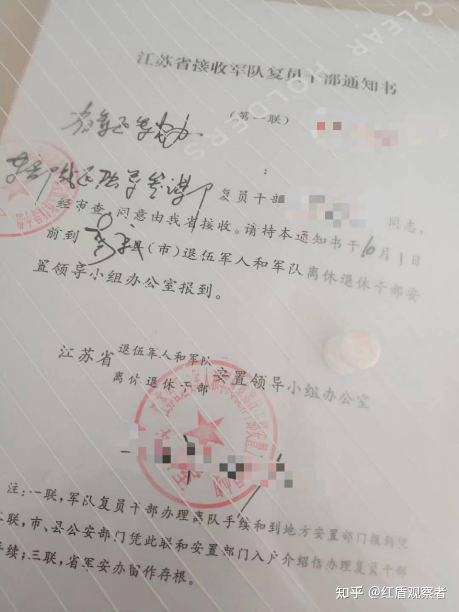
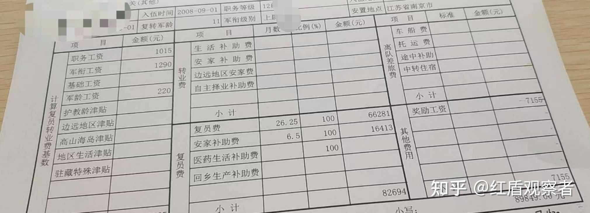
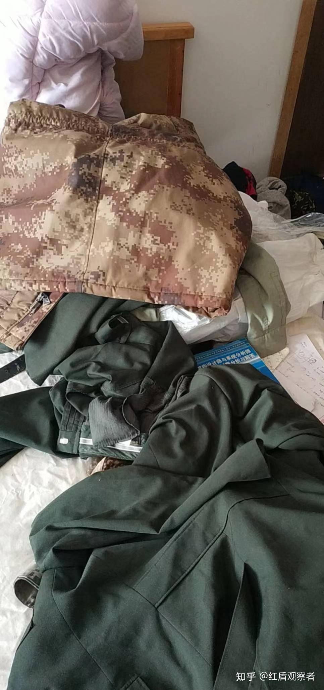

# 报到

2018年10月，移交通知正式"到货"。

这一天终于来临了，我的心情非常激动。

当时，我正在准备考研，初试已经报名，资格复审需要户口，所以我必须赶在11月前落户。

拿到这个通知，意味着马上就可以落户，考研报名的事，就没多大问题了。

除此之外，还有结算。

不少人关心复员费。我只能说，向我这样驻地在大城市的军官，复员费非常少，这点钱还不够一年混饭吃的。

给大家看看我的复员费。

结算单上签完字，一切结束。

再瞅最后一眼宿舍，以后就再也看不到了。

移交通知下达之前，出现了一个有意思的小插曲。

有一天，省民政某人突然给我打电话，说有点事要找我，约在河西万达地铁口碰头。

一开始我以为是骗子，后来对方说了很多我的信息，我才相信他的身份。

他告诉我，同一批接收安置的复员军官的档案太差了，里面不是双开就是刑事，BD怎么能这样不爱护干部？

这么差的档案，让安置部门很为难。一方面，他们必须接受安置，另一方面，他们也不希望安置这么多档案极差的人员。

我的档案里虽然没有处分，但有一份复员申请写的很严厉，里面有些写法非常浮夸。本着公务人员负责任的态度，他要我重新写一份复员申请，交给他换一下，这样对我以后的发展更好。 那天傍晚，河西地铁口，如约碰头。见面时，对方是一个瘦瘦高高的中年人，拎着公文包，一看就是公务员。他拿着我的档案，打开给我看，我进一步确认了他的身份。随后我把重新写好的复员申请交给他。他一边放进档案，一边简要地问我将来的规划，有没有什么困难需要帮助。我说打算考研，南大CS，就在家附近，毕业后重新找工作。他觉得我的规划还不错，就没有接着问了。匆匆离去。

落户那天，我先拿着移交通知去玄武区民政报道。我当时住在富贵山附近，民政距离我的住所不远，步行5分钟就到了。那是一个晴朗的上午，民政门口还有几个人，看起来像是退伍兵。一进门，工作人员娴熟地让我把移交通知给他看看，接着一脸惊讶：

“干部还有复员的？我这里不能安置工作的啊！”

随后他喊来一个女生，让她给我开落户介绍信。结果呢，她找了半天没找到军官复员的落户介绍信（民政主要负责士兵复员落户），无奈之下，只好给我拿了一张士官复员落户介绍信。

“没关系的，这个拿到公安局也能落户。”

整个过程非常快，我一脸懵逼。还没反应过来，她就盖好了章，告诉我：“好了，这里的手续都办好了。”

我说：“移交通知和行政关系介绍信需要给你们吗？”

她来了句：“看过了就行，自己留着。”

就这样，移交相关手续最后全都留在了我自己手里，成了我个人经历的纪念品。

当天下午，我立即赶到玄武区公安分局办理落户。

前台办理户籍是一位漂亮的小姐姐，她看了我的落户通知，说道，你是士官啊。然后看到我的复员证，又问，你怎么拿着军官的复员证。我说这个通知是民政局给我开的，我也没看清楚，应该不影响落户吧。她说落户肯定没问题。

办理户籍的过程很快，十分钟搞定。拿到户口本后，我立马跑到二楼办出入境证件，赶在单位给我涉密备案之前一口气办好了护照和港澳通行证手续，七天后拿证。三个月之后，单位果然给我进行了备案，脱密期五年，要了命了。好在我手里有护照，对出行的影响不大，只是香港澳门台湾去不了了。

走出公安分局，心里的石头终于落了地。

我心里有一个声音在呼喊：“终于有户口啦！！！终于不是黑户啦！！！终于恢复了正常人的身份啦！！！”

外面的马路上，车流人流熙熙攘攘，一切都显得那么美好。