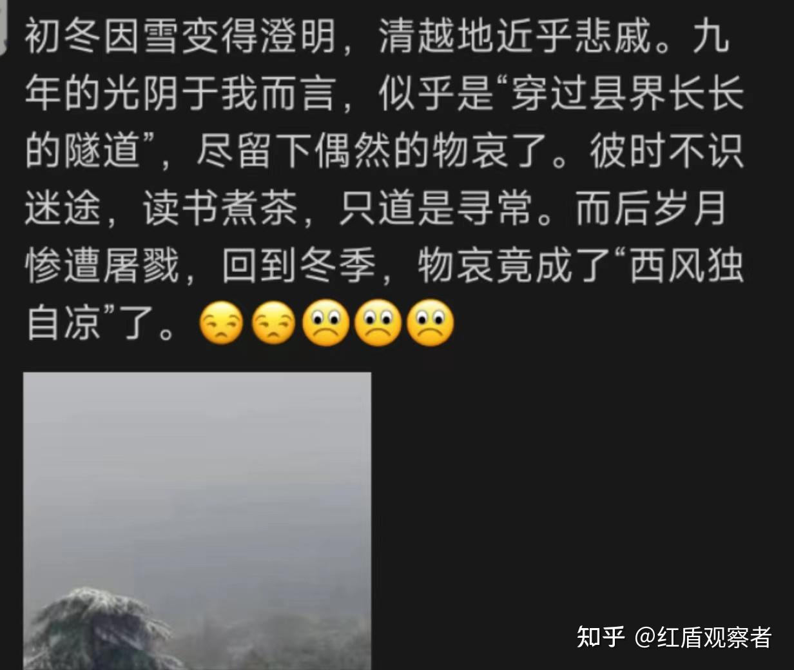

在我的军官岁月中，除了搞副业，读书也可以用来排遣无聊。

那些年，我几乎不和其他人有过深入交流，大体上是因为担心被周围的精神所污染，未来变成一个无比讨厌的自我。酒场我去，套话我讲，寒暄我有，但书肯定也是要读的，而且要静静地读，在一个人的世界里，布局自己的精神结构，不为他人所窥见。

我对书的要求比较高，什么叫高呢，就是要足够抽象，惜字如金的那种。在这方面，罗贝托波拉尼奥做的很好。

比如这句话

众所周知，历史就是一个婊子，没有什么决定性时刻，而只有分分秒秒的可怕流逝。
安妮埃尔诺在《悠悠岁月》中，把同样的意思用另一种方式又表达了一遍：

在个人的生活进程里，历史是没有意义的。我们只是根据日子的不同而感到幸福和不幸福。
相比而言，我更喜欢波拉尼奥的表达，尤其“婊子”一词，使用的极为传神。《吠陀经》里说，真理只有一个,而圣人用各种不同的名字称呼它。虽然波拉尼奥和安妮埃尔诺，表达的都是解构主义的倾向，但我却乐于对比品味分析文字表达本身的趣味。和敲代码一样，自然语言也是一种编码。代码编码数学，人类语言编码灵魂。

川端康成《雪国》，是我隔一段时间就要重读的作品。这本小说，承载了我太多的个人情感，以至于多年之后，每每读到“穿过县界长长的隧道”，思绪变飘进了白雪覆盖着的纯净世界。在那里，或许也深藏着一个自我灵魂的副本。

川端康城作品的气质，十分符合我在军中服役时的心境。

众所周知，川端的作品因其对于人性细节的刻画中总是渗透着一种物哀的情绪，所以为爱打鸡血的军国主义者所不容。这与我当时的处境非常相似。虽然做了军官，但我对于军旅文化可以说相当反感。我不热爱集体，喜欢独处和安静，讲究人与人之间的界限与分寸感。我善于对细节观察入微，对人性的观察也时刻渗透着悲观和伤感。

军中的生活却与我的天性相斥，尤其在基层，嘎吱吱斑驳的铁床，灰绿色迷彩的汗渍，作战靴的皮臭味，上铺撸管有节奏地晃动，一直折腾之后，周围的鼾声又潮水一般响起。

浑浊的空气与精神令我时刻警惕，防止它们在不知不觉中溜入身心。我需要通过不断地读书来净化自己身心。

《雪国》里那清澈澄明的世界，便是我在沉闷岁月里难得的精神归宿。

贴一个我当时发的朋友圈吧！

除了川端康城，日本作家谷崎润一郎、三岛由纪夫，俳句诗人小林一茶、松尾芭蕉也都是我所爱。快要复员的时候，我整整一年都在读三岛的《丰饶之海》，沉迷于三岛对于松枝清显和聪子的爱情的描绘。

我的日语功底有限，无法直接读原著。若是英美文学，我就可以直接阅读原版了。

最喜欢的作品列表，有woolf的《海浪》、福克纳的《喧哗与骚动》、查尔斯劳伦斯系列作品，有段时间还读完了匈牙利作家马洛伊山多尔的作品集。至于茨威格纳博科夫，那些都是高中读过的了，有时候也会回头品读。当然，这些都是文学。

文学只是我阅读列表的一部分。文艺是先锋，它是我精神城墙上排在最前沿的战士。任何对我思想的入侵都将被我的精神文艺战士迅速反击。

有一天，政工系干部，包括主任，在全单位推销阅读周小平的书，意在对官兵进行思想教育、栓心留人。听到此消息，我感到非常惊讶。没想到，单位领导的文化层次这么低呀，居然对周小平佩服的五体投地！

那一刻，我就感到这地方绝无可能是我的归宿，将来，我一定会离开这里，远离这些人，从此再无交集。每一次政治教育，都在进一步坚定我复员的意志。

除了文学之外，我还涉猎政治学、社会学、经济学以及哲学。有的书评价不是很高，我大概也记不得名字了。反正大多都用来派遣无聊罢。数学也是我的爱好之一，无所事事之时，有时会做一些近世代数的证明。我本科毕业后六年依然能够一战考研985就上岸，恐怕和我坚持读书的习惯有关。

那些年，我的数学功底不但没落下，反而越来越强。英文水平也随着阅读原著而不断提升。到了复员考研的时候，我已经不用复习英语，裸考英一直接82，背几篇范文就足够了。

平时下班和外出的时候，最喜欢去逛的也是南京的旧书店以及先锋书店。和别人网红打卡不同，我去的目的，就是想看看老板又上了什么新书。先锋书店的钱小华品味很高，书店里绝对看不到***系列，而且他会定时上一些新书，品类的确很”先锋“。

然而，我因为喜欢读书，却遭了某些人的记恨。有人把我爱读英文原著这件事告密给了政委，说我思想有问题。这事儿被政委和一号都知道了，他们分别把我喊到办公室，问我能不能给他们的女儿辅导英语。我说，可以啊！但是谁告密的呢？政委一脸莫测，笑而不语。他说，爱读书是好事啊，我女儿像你一样就好了！我就是没什么文化，才来当的这个兵。

最后，他还对我进行了鼓励。

”马上就要改革了，你或许有机会能走。加油吧，出去之后，你一定比单位大多数干部发展的都好！“

言语轻松，阳光明媚。窗边的绿植在微风中轻轻摇曳。后来，回想起来，那竟是我人生中最后一次在办公室和他交谈。

