# ROS是什么

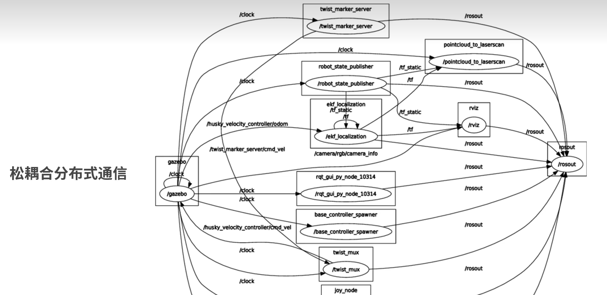

椭圆是节点，线是通信，方框是命名空间？

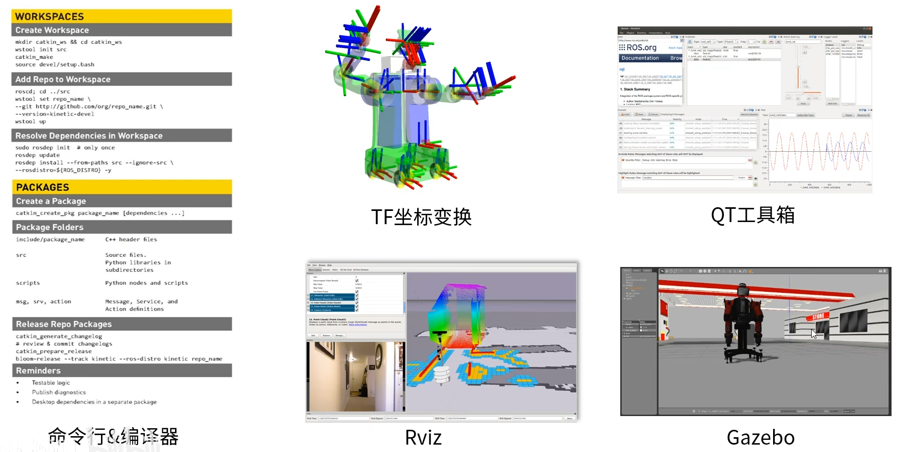

TF：坐标变换

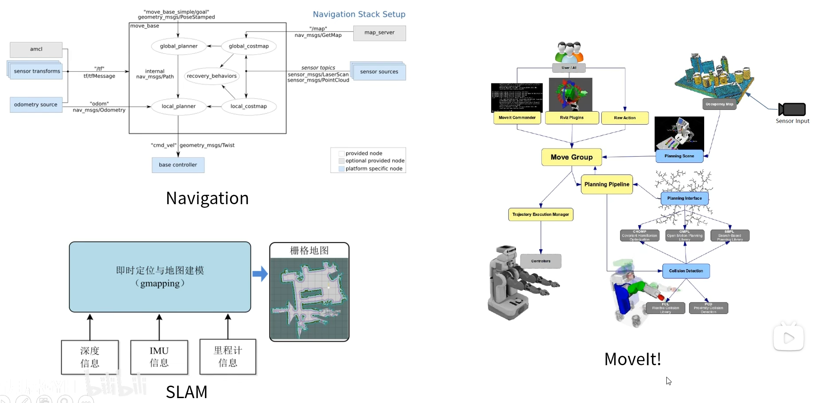

# ROS核心概念

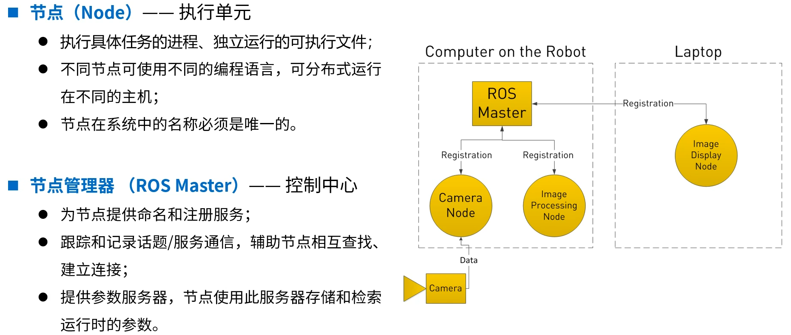

节点：名称唯一

节点管理器：节点注册、记录话题和通信、存储节点参数

发布、订阅、话题：通信机制、数据管道

消息：定义话题的数据结构，类似于protobuf文件

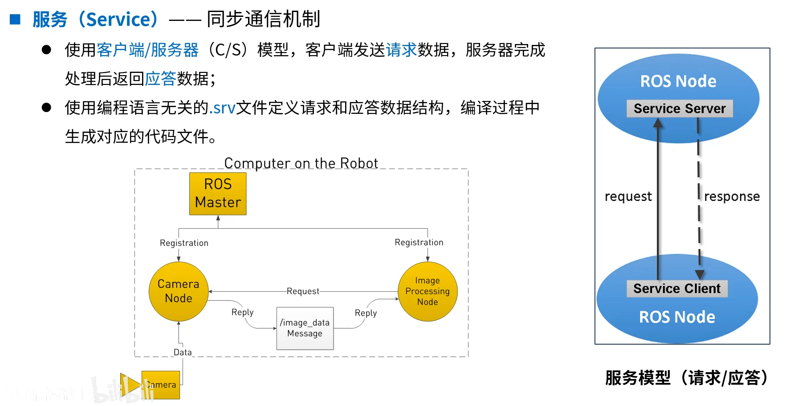


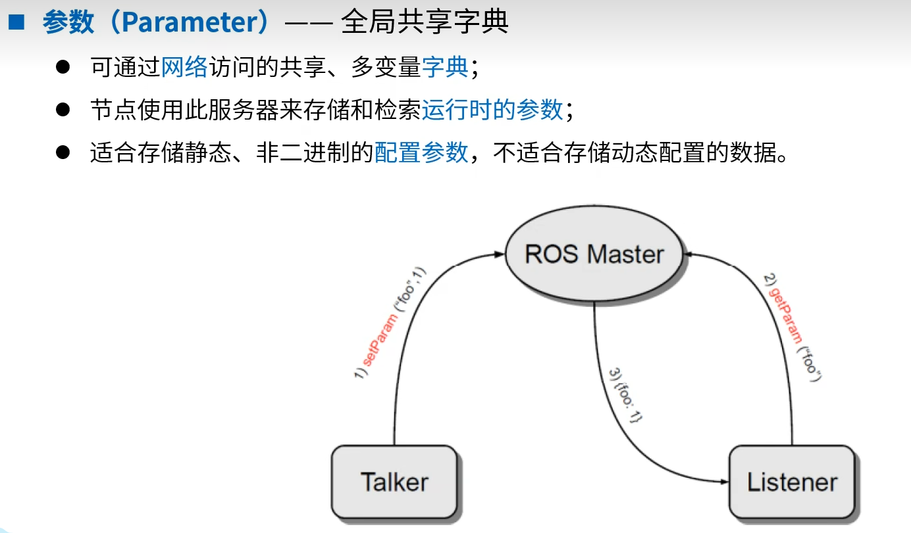

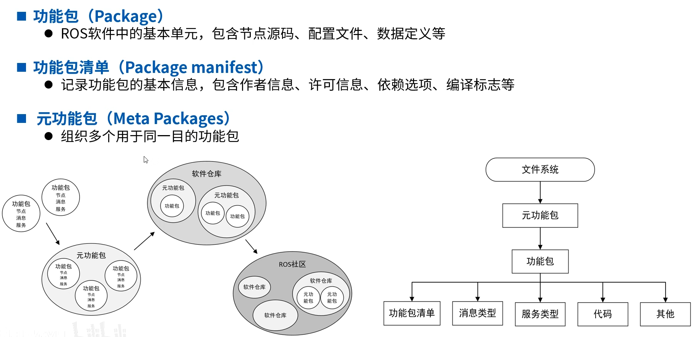

# ros命令行工具

rostopic
rospack
rosnode
rospack
rosmsg
rossrv
rosparam


# Cheatsheet

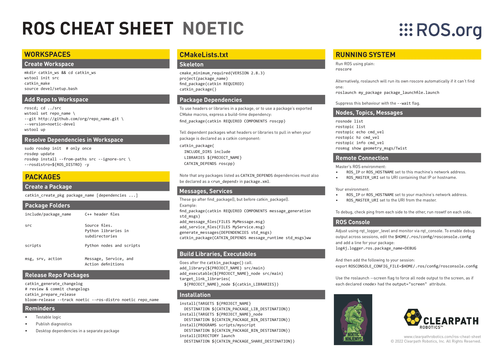

```sh
rosnode list
rosnode info /rosout

rostopic pub <topic_name> <topic_content>

rosmsg show <topic>

rosservice list
rosservice call /spawn "param"


rosbag record -a -O 
```

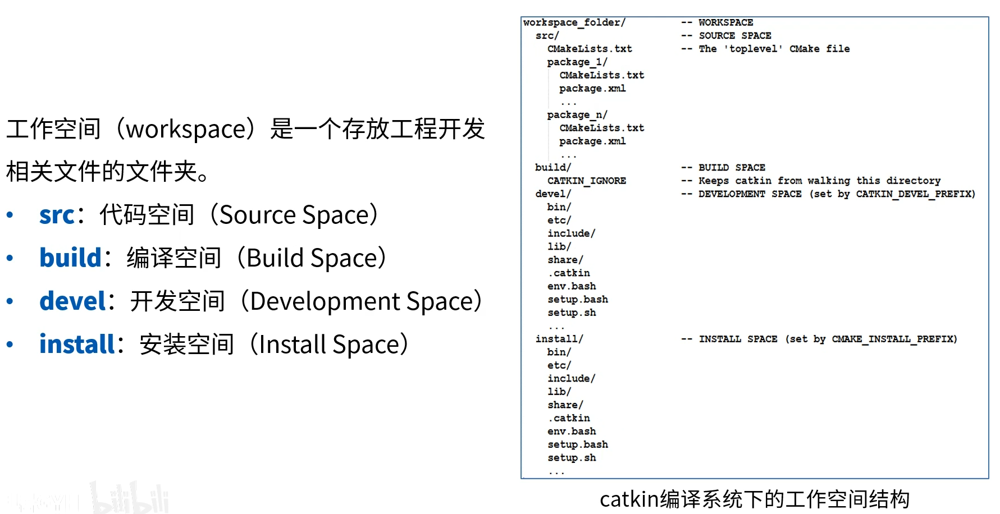

# 工作空间和功能包

工作空间的四个目录：
src：源码目录
devel：编译好的二进制目录？？
build：构建目录。cmake日志：build files have been written to ***/build
install：执行catkin_make install，认为已经开发结束进入发布阶段。

创建和编译自定义的包

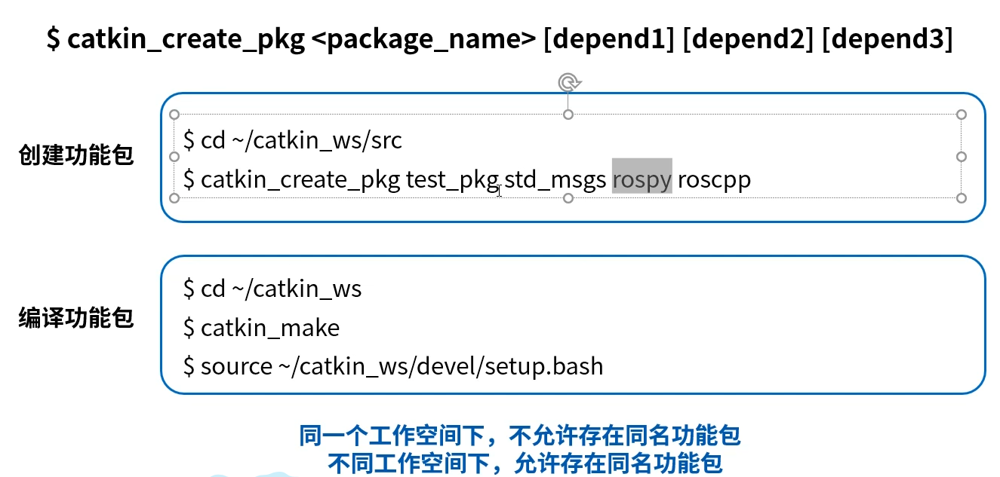

catkin_create_pkg <pkg_name> <depend_1> <depend_2> ...

包里面：
src/
include/
CMakeLists.txt
package.xml
后两个文件标志着包叫包而不是简单的目录。

cmake：target_link_libraries 用于将库进行链接。

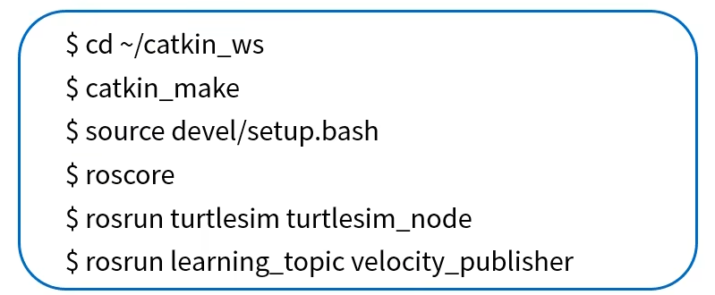

编译之后，devel中有编译出的二进制文件。

python的程序单独在包里建一个scripts目录存放？

# 话题消息的定义和使用

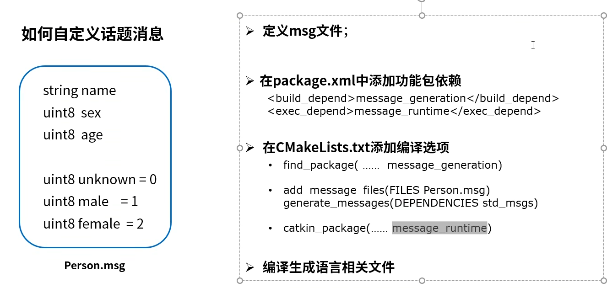

编译出的头文件在devel/include/xxx.h中


其中，add_dependencies是因为需要先编译消息。

# 服务的client端编程实现

